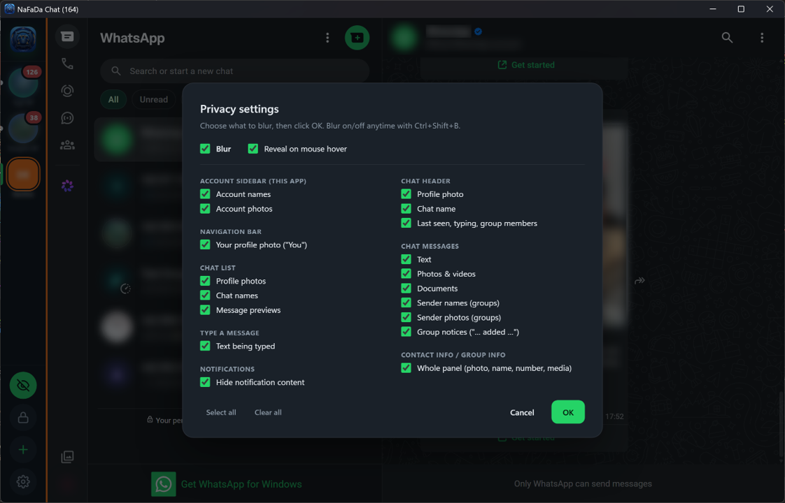
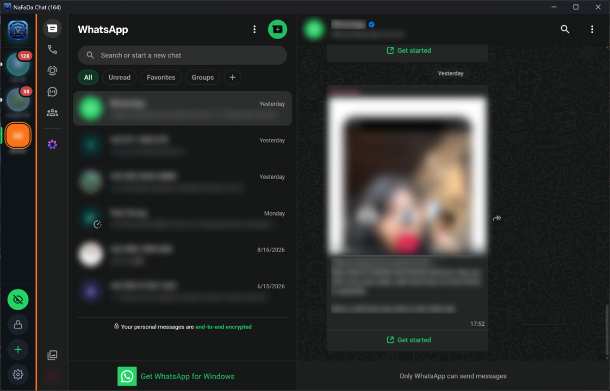
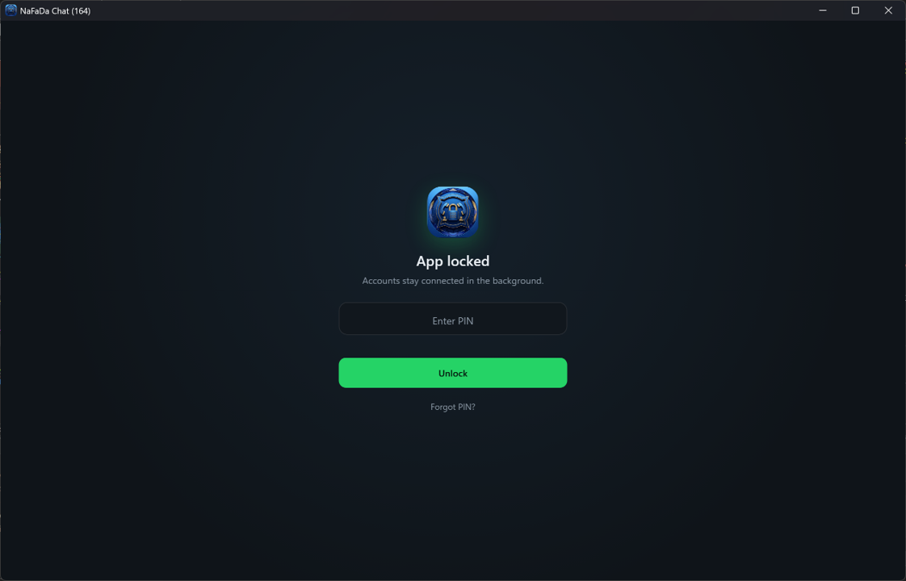

# NaFaDa Chat

Unofficial portable Windows app for using multiple WhatsApp Web accounts in one window. All accounts stay active at once, with privacy blur & PIN lock.

NaFaDa Chat replaces WhatsApp Web Multi Account (`WAWebMultiAcc.exe`, versions 1.0.0–1.0.3), which is discontinued and no longer updates itself. To switch, see [Coming from WhatsApp Web Multi Account](#coming-from-whatsapp-web-multi-account).

<p align="center">
  
  
  
</p>

## Features

**Accounts**
- Every account has its own isolated session and stays connected, even while the window is hidden in the tray.
- The sidebar shows each account's WhatsApp profile photo and name automatically, refreshed every 6 hours. Names you set yourself are never overwritten.
- Right-click an account to rename it (emoji welcome, e.g. "🛒 Shop A"), change its color or zoom, mute it, reload it, move it, or remove it. Drag accounts to reorder them.
- Each account gets its own color. The active account's color also shows as a strip next to WhatsApp, so you can tell which account you are using even when names and photos are blurred.
- Zoom per account, 50–200% (`Ctrl+Plus` / `Ctrl+Minus` / `Ctrl+0`, or `Ctrl` + mouse wheel).
- Spell checking, with suggestions in the right-click menu of the message box. Turn it off or choose up to 5 languages in ⚙ → Spell check.
- Accounts that crash or fail to load (for example while offline) reload by themselves.

**Notifications & unread messages**
- Windows notifications per account. Clicking one opens the account that received it.
- **Mute** an account for 1 hour, 8 hours, until morning, any number of hours you type (decimals allowed, up to 720), or until you unmute it (right-click → Mute notifications). Muted accounts show no notifications and play no sounds unless they are on screen, are left out of the taskbar and tray badges, and do not flash the taskbar.
- If WhatsApp signs an account out (for example after your phone was offline for weeks), the account gets a "!" mark, Windows shows a notification, and the tray tooltip names it, so it never goes unnoticed.
- Unread badges per account, with the total in the window title. The taskbar button and the tray icon show the number as a red badge (up to 99, then "99+"), and the tray tooltip lists the count per account.

**Privacy**
- Choose exactly what to blur: your account names and photos in the sidebar, your own photo, the chat list (photos, names, message previews), the chat header, the messages (text, photos, videos, documents, group sender names and photos, group notices), the text being typed, and the contact/group info panel.
- Turn blur on or off with the eye button or `Ctrl+Shift+B`. Optionally, a blurred item shows clearly while the mouse is over it.
- If a WhatsApp Web change stops part of the blur from working, the eye button shows a yellow dot and the app tells you which part. Fixed blur rules usually arrive automatically, without a new app version.
- Notification content can be hidden: notifications then show only the account name and "New message".
- The window can be hidden from screenshots and screen sharing (⚙ → Privacy).
- PIN lock (4–12 digits), with auto-lock after 1–60 idle minutes or when Windows locks or sleeps. Accounts stay connected while locked. Forgot the PIN? Reset it from the lock screen: every account is signed out and its data on this device is deleted first.

**Memory saver** (⚙ → Memory saver)
- Reloads background accounts that grow past a limit you choose, without signing out. The account on screen is never touched.
- **View memory usage** shows the memory of each account, like Task Manager.

**Other**
- The app speaks your language: English, Chinese (Simplified), Hindi, Spanish, Arabic, French, Bengali, Portuguese, Russian, or Indonesian. It starts in your Windows language when available; change it in ⚙ → Language. Once signed in, WhatsApp Web itself uses your phone's language.
- Found a problem or missing a feature? ⚙ → **Report a problem or request a feature** sends a private report straight to the developer. Reports are not public.
- Show or hide the app from any program with a shortcut (`Ctrl+Alt+W` by default, can be changed). Optionally, the app locks when hidden this way.
- Start with Windows, start hidden in the tray, and close to the tray.
- Opening the app a second time brings up the running window instead of starting a copy.
- Move the data folder anywhere (⚙ → Data folder), with or without your sign-ins.
- Automatic updates: the app tells you when a new version is available and installs it only with your consent. The previous version is kept and can be restored (⚙ → Updates → Restore previous version).
- Point at the app icon at the top of the sidebar to see the version.

## Keyboard shortcuts

| Shortcut | Action |
|---|---|
| `Ctrl+1` … `Ctrl+9` | Go to account 1–9 |
| `Ctrl+Tab` / `Ctrl+Shift+Tab` | Next / previous account |
| `Ctrl+Shift+U` | Next account with unread messages |
| `Ctrl+Shift+N` | Add an account |
| `Ctrl+Shift+R` | Reload the active account |
| `Ctrl+Shift+B` | Blur on/off |
| `Ctrl+Shift+L` | Lock the app (or set a PIN first) |
| `Ctrl+Plus` / `Ctrl+Minus` / `Ctrl+0` | Zoom the active account in / out / 100% |
| `Ctrl+Alt+W` (can be changed) | Show / hide the app from any program |

## Good to know

- **Memory use.** Each signed-in account uses about 300–600 MB of RAM, depending on how many chats it has. That is the same as one WhatsApp Web tab in a browser. On top of that, WhatsApp's service worker takes about 60 MB per account, and the app itself about 200 MB. For example, 3 accounts use about 1.5–1.9 GB.
- **WhatsApp's device limit.** One phone number can be linked to at most 4 devices. If scanning the QR code fails, open WhatsApp on your phone → **Linked devices** and log out a device you no longer use.

## Download

Go to **[Releases](../../releases/latest)** and download `NaFaDaChat-<version>-x64.zip`. Extract it to a folder of its own (a USB drive works too), then run `NaFaDaChat.exe`.

Then scan the QR code with your phone (WhatsApp → Linked devices → Link a device). Use **+** in the sidebar to add more accounts.

The app checks for updates by itself and installs a new version only after you agree.

Windows SmartScreen may show a warning the first time. Click **More info → Run anyway**.

### Coming from WhatsApp Web Multi Account

The old app (`WAWebMultiAcc.exe`) does not update to NaFaDa Chat by itself. To switch and keep your accounts:

1. In the old app, turn off ⚙ → **Start with Windows** if it is on, then quit it (tray → Quit).
2. Extract the NaFaDa Chat zip to a new folder.
3. Copy the `Data` folder from the old app folder into the new folder. If you moved your data elsewhere, also copy `WAWebMultiAcc.config.json`; NaFaDa Chat picks it up.
4. Run `NaFaDaChat.exe`. Your accounts open signed in, with their names, colors and settings.
5. Once everything works, delete the old app folder.

## Verifying your download

- Each release includes `SHA256SUMS.txt`. To check a file, run this in PowerShell:
  ```
  Get-FileHash .\NaFaDaChat-<version>-x64.zip
  ```
  The result must match that file's line in `SHA256SUMS.txt`.
- Automatic updates install only files digitally signed by the developer. The app rejects anything that was altered.
- Download only from this repository's Releases page.

## Privacy

The app connects to WhatsApp Web and, for updates, to the files in this repository (`update/latest.json` and `update/privacy-rules.json`). It does not send account data, messages, or usage information anywhere.

Spell-check dictionaries are downloaded once per language from Google's servers, as in Chrome. No text you type is sent.

**Report a problem or request a feature** loads a Google Form only when you open it. Only what you type into the form reaches the developer, plus the app and Windows versions it fills in for you. Your contact email is optional. Reports are kept in the developer's Google account, used only to answer you and improve the app, and never shared. Google's privacy policy applies to the form itself.

The `Data` folder next to the app holds your login sessions. Anyone who copies it may be able to open your accounts:

- Protect it with BitLocker, or BitLocker To Go on a USB drive.
- If you think it was copied, open WhatsApp on your phone → **Linked devices** and log out any device you do not recognize.

## What is in this repository

- `update/latest.json`: information about the latest version (signed).
- `update/privacy-rules.json`: the latest privacy (blur) rules (signed and encrypted).

The source code is not published.

## License

Free to use, for personal and business purposes, under the [NaFaDa Chat Freeware License](LICENSE.txt). The app may not be modified, sold, or redistributed. To share it, share a link to the Releases page.

- **Use it lawfully.** Fraud, scams, spam, harassment, impersonation, using accounts that are not yours, or misusing other people's data is prohibited and ends your license.
- **You are responsible** for your accounts, the data in them, and how you use it. You agree to cover any claim against the developer that results from your misuse.
- **No warranty.** The app is provided as is, at your own risk. It may not meet your expectations or may stop working when WhatsApp Web changes, and the developer owes no support or fixes. As far as the law allows, the developer is not liable for any loss, including lost accounts or data.
- The license is governed by Indonesian law. It does not take away consumer rights that your country's law gives you.

---

This is an independent app. It is not affiliated with, endorsed by, or sponsored by WhatsApp LLC or Meta Platforms, Inc.
