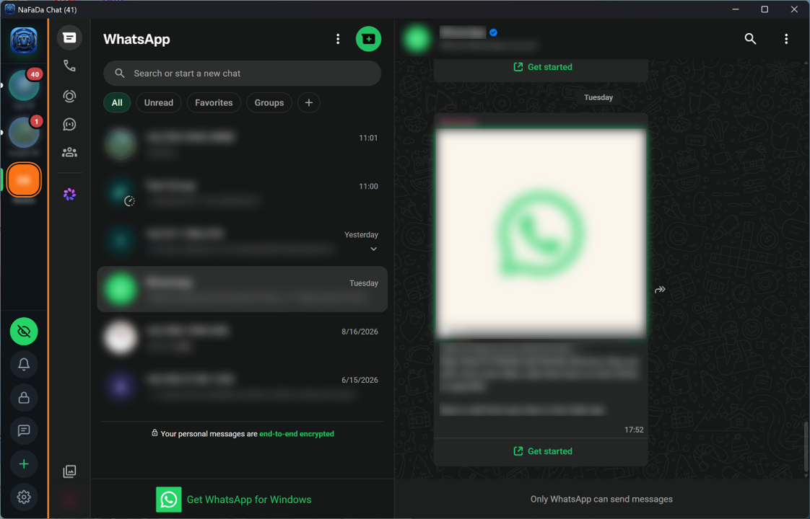
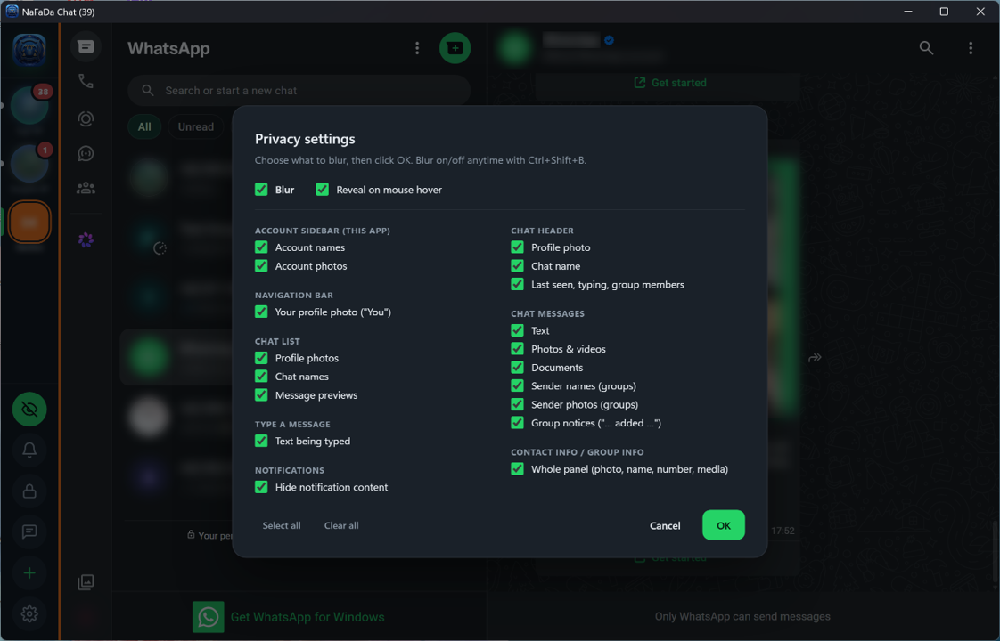
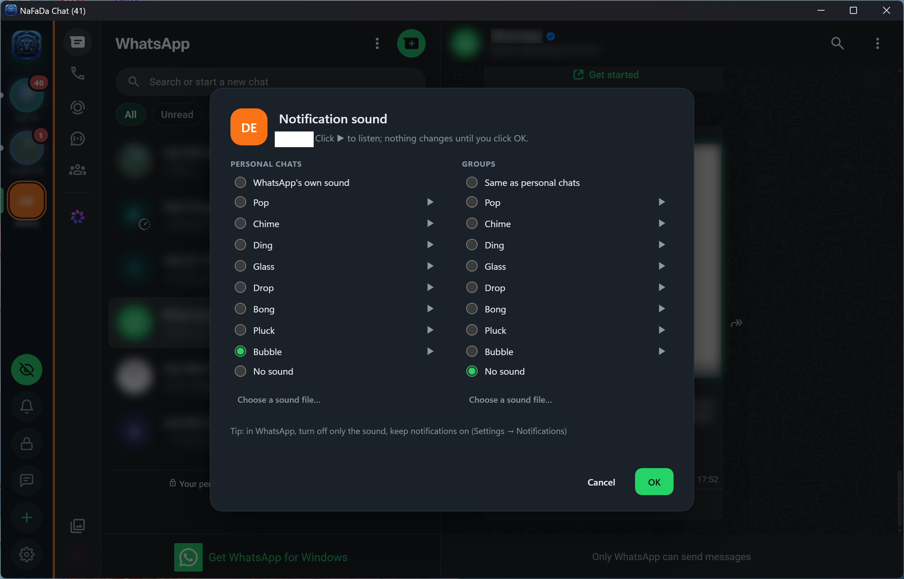
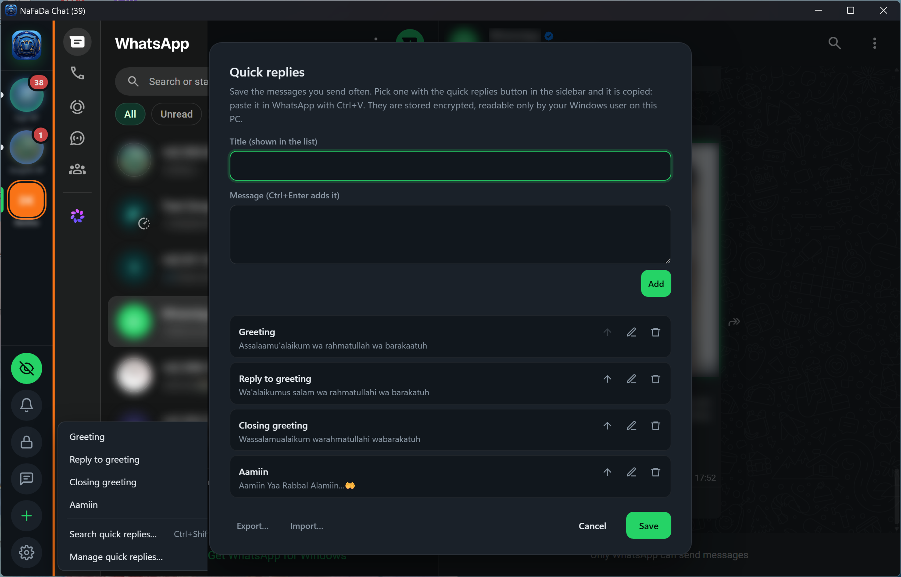
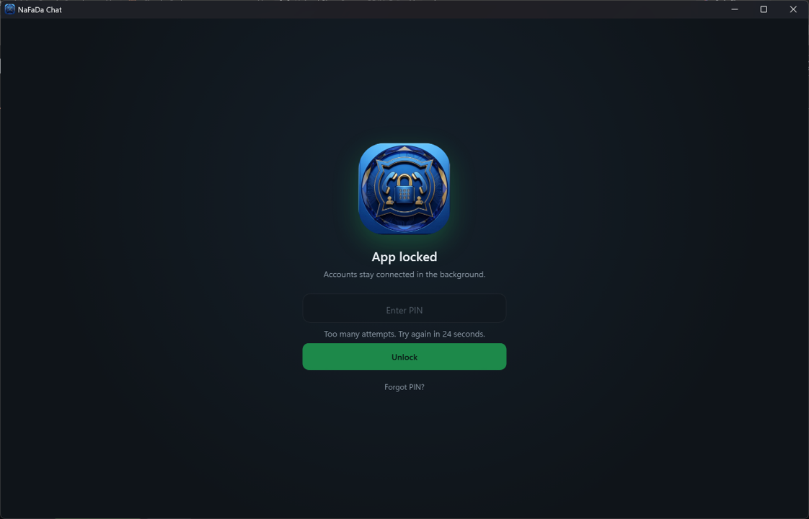

# NaFaDa Chat

[](../../releases/latest)
[](#download)
[](LICENSE.txt)

Use several WhatsApp accounts side by side in one Windows window. Each account runs the official WhatsApp Web page in its own isolated session, and all of them stay active at once. Includes privacy blur, PIN lock and a sound per account. Portable: no installation.

> NaFaDa Chat replaces **WhatsApp Web Multi Account** (`WAWebMultiAcc.exe`, 1.0.0–1.0.3), which is discontinued. See [Coming from WhatsApp Web Multi Account](#coming-from-whatsapp-web-multi-account).

<p align="center">
  
  
  
  
  
</p>

## Download

1. Download `NaFaDaChat-<version>-x64.zip` from **[Releases](../../releases/latest)**. Download it only from there.
2. [Check the file](#verify-your-download) (recommended), then extract it to a folder of its own.
3. Run `NaFaDaChat.exe` and scan the QR code with your phone (WhatsApp → **Linked devices** → **Link a device**). Use **+** in the sidebar to add more accounts.

Requires Windows 10 or 11 (64-bit) and about 0.5 GB of free RAM per account (see [Limitations](#limitations)).

**Windows SmartScreen** may warn the first time, because the app is not code-signed with a paid certificate yet. Check the file first, then click **More info → Run anyway**.

## Security & privacy at a glance

Read this before you sign in. The app holds your WhatsApp sessions. This section describes how the app is designed to work; it is not a guarantee (see [License](#license)).

| Question | Answer |
|---|---|
| Where is my data? | In the `Data` folder next to the app, on your computer only. The app has no server and no account system. |
| What does the app connect to? | WhatsApp Web, this repository (for updates), and Google only when you use spell check or the report form. [Full list](#network-connections) |
| Does it collect usage data? | No. There is no telemetry, analytics or crash upload. |
| Is the `Data` folder encrypted? | **No, not by the app.** Anyone with a copy of it may be able to open your accounts. [Protect it](#protect-your-data-folder). |
| Does the PIN encrypt anything? | **No.** The PIN locks the app window. It does not encrypt the `Data` folder. [Details](#pin-lock) |
| Can an update be faked? | Updates and privacy rules must carry the developer's signature, and the app rejects anything else. [Details](#updates) |
| Does it automate WhatsApp? | No. It never types or sends messages for you. Each account is an ordinary linked device. |
| Is the source code public? | No (freeware). This README lists what the app does so you can judge it, and you can check it yourself with a firewall or network monitor. |

## Features

- **Many accounts, one window.** Each account has its own isolated session and stays connected, even while the window is hidden in the tray.
- **Know which account is which.** Profile photos and names appear automatically. Each account has its own color, shown as a strip next to WhatsApp.
- **A sound per account**, one for its **groups** if you like, plus a different sound when you are **@mentioned** in a group. **Mute all** silences every account at once.
- **Privacy blur.** Choose exactly what to blur, and turn it on or off with the eye button or `Ctrl+Shift+B`.
- **PIN lock**, after idle time, when Windows locks, or at a set time every day.
- **Working hours.** Chosen accounts are muted outside your working hours.
- **Quick replies.** Saved messages, copied with one click. The app never sends them for you.
- **Unread badges** on the taskbar and tray, plus mute for 1 hour, 8 hours, until morning or always.
- **Memory saver**, 10 languages, keyboard shortcuts, export and import of settings, and signed automatic updates.

<details>
<summary><b>All features in detail</b></summary>

### Accounts
- The sidebar shows each account's WhatsApp profile photo and name, refreshed every 6 hours. Names you set yourself are never overwritten.
- Right-click an account to rename it (emoji welcome, e.g. "🛒 Shop A"), change its color or zoom, mute it, reload it, move it, or remove it. Drag accounts to reorder them.
- Zoom per account, 50–200% (`Ctrl+Plus` / `Ctrl+Minus` / `Ctrl+0`, or `Ctrl` + mouse wheel).
- Spell checking, with suggestions in the right-click menu of the message box. Choose up to 5 languages in ⚙ → Spell check.
- Accounts that crash or fail to load (for example while offline) reload by themselves.

### Notifications & unread messages
- Windows notifications per account. Clicking one opens the account that received it.
- **Mute** an account for 1 hour, 8 hours, until morning, a number of hours you type (up to 720), or until you unmute it. Muted accounts show no notifications, play no sounds unless they are on screen, and are left out of the badges.
- **Signed-out alert.** If WhatsApp signs an account out, it gets a "!" mark, Windows shows a notification and the tray tooltip names it.
- **Working hours** (⚙ → Working hours & scheduled lock). When work ends, the chosen accounts are muted until it starts again.
- **Notification sound per account** (right-click → Notification sound…): personal chats on the left, groups on the right. WhatsApp's own, one of 8 built-in sounds, a sound file of your own (MP3, WAV, OGG or M4A), or none; groups can also use the same sound as personal chats. Listen to each one with ▶ first: nothing changes until you click OK.
- **Mute all** (the bell below the eye button): every sound off at once, notifications still show. Click again to turn the sounds back on; each account keeps its own settings.
  > **Important:** to hear only the app's sound, turn off only the *sounds* in WhatsApp (Settings → Notifications) and keep its *notifications* on. The app plays a sound only when WhatsApp shows a notification.
- **Mention sound** (right-click → Sound when I'm mentioned (@)…). Your WhatsApp name and number always count, and you can add other words. The check runs inside WhatsApp's page, and the message text never leaves it.
- Unread counts per account in the window title, and as a red badge on the taskbar and tray (up to 99, then "99+").

### Privacy
- Blur your account names and photos, your own photo, the chat list, the chat header, the messages, the text being typed, and the contact info panel. Optionally, a blurred item shows clearly while the mouse is over it.
- If a WhatsApp Web change breaks part of the blur, the eye button shows a yellow dot and tells you which part. When the developer publishes a fix in the privacy rules, it arrives automatically, without a new app version.
- Notifications can show only the account name and "New message".
- The window is hidden from screenshots and screen sharing (⚙ → Privacy; on by default for new installs). This depends on Windows and the other program, and cannot stop every way of capturing the screen, such as a camera.

### Lock, quick replies, memory
- PIN lock (4–12 digits), with auto-lock after 1–60 idle minutes, when Windows locks or sleeps, or every day at a time you choose. Accounts stay connected while locked. Right-click the lock button to lock now, change or turn off the PIN, or set auto-lock.
- Quick replies: the speech-bubble button lists their titles; click one and it is copied. Search quick replies… (or `Ctrl+Shift+Q`) opens a list where you type to search and pick one with a click or `Enter`. It is copied, and you paste it with `Ctrl+V`. Manage quick replies… edits them, and exports and imports them, to move them to another PC or share them with a colleague.
- Memory saver (⚙ → Memory saver) reloads background accounts that grow past a limit you choose, without signing out. **View memory usage** shows each account's memory use.

### Other
- Languages: English, Chinese (Simplified), Hindi, Spanish, Arabic, French, Bengali, Portuguese, Russian, Indonesian. The app starts in your Windows language. Once signed in, WhatsApp Web itself uses your phone's language.
- Show or hide the app from any program (`Ctrl+Alt+W`, can be changed), optionally locking it.
- Start with Windows, start hidden in the tray, close to the tray. A second start brings up the running window.
- Move the data folder anywhere (⚙ → Data folder).
- Export and import all settings in one file (⚙ → Export / import settings): accounts with their names, colors, order, zoom, sounds (including your own sound files) and mention words, privacy settings, working hours, quick replies and the general settings. Sessions, profile photos and the PIN are never exported.
- Exported files can be protected with a password (AES-256-GCM). Without the password they cannot be read or imported, and a forgotten password cannot be recovered.
- Tips on the first start. Open them again from ⚙ → Tips or by clicking the logo at the top of the sidebar.
- ⚙ → **Report a problem or request a feature** sends a private report to the developer. Not every report or request can be handled or answered: that depends on the developer's time, priorities and other considerations. Do not put passwords, PINs or verification codes in a report.

</details>

## Keyboard shortcuts

| Shortcut | Action |
|---|---|
| `Ctrl+1` … `Ctrl+9` | Go to account 1–9 |
| `Ctrl+Tab` / `Ctrl+Shift+Tab` | Next / previous account |
| `Ctrl+Shift+U` | Next account with unread messages |
| `Ctrl+Shift+N` | Add an account |
| `Ctrl+Shift+Q` | Search quick replies |
| `Ctrl+Shift+R` | Reload the active account |
| `Ctrl+Shift+B` | Blur on/off |
| `Ctrl+Shift+L` | Lock the app (or set a PIN first) |
| `Ctrl+Plus` / `Ctrl+Minus` / `Ctrl+0` | Zoom the active account in / out / 100% |
| `Ctrl+Alt+W` (can be changed) | Show / hide the app from any program |

## Coming from WhatsApp Web Multi Account

The old app does not update to NaFaDa Chat by itself. To switch and keep your accounts:

1. In the old app, turn off ⚙ → **Start with Windows** if it is on, then quit it (tray → Quit).
2. Extract the NaFaDa Chat zip to a new folder.
3. Copy the `Data` folder from the old app folder into the new folder. If you moved your data elsewhere, also copy `WAWebMultiAcc.config.json`.
4. Run `NaFaDaChat.exe`. Your accounts open signed in, with their names, colors and settings.
5. Once everything works, delete the old app folder.

## Security details

### Protect your Data folder

The `Data` folder holds your WhatsApp login sessions. **Treat it like a password.** Anyone who gets a usable copy of it may be able to open your accounts, without your PIN and without your phone.

- Keep it on an encrypted drive: BitLocker, or BitLocker To Go on a USB drive. Do not keep it on a shared or network folder.
- Do not use the app on a PC that other people use with your Windows account.
- If you think the folder was copied, open WhatsApp on your phone → **Linked devices** and log out every device you do not recognize.

Quick replies are stored in the same folder, encrypted so that only your Windows user on this PC can read them. On another PC or Windows user they cannot be read; to move them, use Export… and Import… in Manage quick replies…. Exported quick replies and settings files are encrypted only when you give them a password; without one they are plain files. A reply you pick goes to the Windows clipboard, where other programs can read it, so do not save passwords or secrets as quick replies.

### PIN lock

The PIN is a privacy screen for the app window, like a screen lock. It is not encryption:

- It hides your chats from people at your PC. Accounts stay connected while the app is locked.
- It does **not** encrypt the `Data` folder, so it does not protect a copy of that folder.
- The PIN is stored only as a salted hash (scrypt), never as plain text. From the 5th wrong PIN on, each wrong PIN starts a longer wait: 30 seconds, then 1, 2, 4 and at most 5 minutes. The lock screen counts the wait down. Restarting the app does not reset the wait.
- **Forgot the PIN?** You can reset it from the lock screen, but every account is then signed out and its data on this PC is deleted first. Otherwise, anyone at your PC could reset the PIN and read your chats.

### Updates

- The app checks this repository for `update/latest.json` and installs a new version **only after you agree**.
- That file is signed with the developer's Ed25519 key. It lists the size and SHA-256 of every download, and the app rejects any file that does not match.
- `update/privacy-rules.json` (what to blur, and how to read names, unread counts, mentions and group chats from WhatsApp Web) is signed the same way. It is also encrypted, but only to keep it from casual readers: the signature is what protects it.
- The previous version is kept, and you can restore it (⚙ → Updates → Restore previous version).

### Network connections

The app itself connects to:

| Address | When | What is sent |
|---|---|---|
| `web.whatsapp.com` and WhatsApp's servers | Always, per account | The same as WhatsApp Web in a browser |
| `raw.githubusercontent.com`, `github.com` (this repository) | Update checks, and downloads you approve | An ordinary download request; no account data |
| Google spell-check dictionary servers | Once per spell-check language you choose, as in Chrome | A dictionary download; no typed text |
| `docs.google.com` (Google Forms) | Only when you open **Report a problem** | What you type in the form, plus the app and Windows versions. Your contact email is optional. |

Notification sounds, mention detection, working hours, the scheduled lock, quick replies, and export and import all run on your computer only.

Reports are kept in the developer's Google account, used to answer you and to improve the app, and not sold or published. Not every report or request can be answered or handled. Google's privacy policy applies to the form itself.

### Verify your download

Each release includes `SHA256SUMS.txt`. In PowerShell, run:

```powershell
Get-FileHash .\NaFaDaChat-<version>-x64.zip
```

The result must match that file's line in `SHA256SUMS.txt`.

## Limitations

- **Memory.** Each signed-in account uses about 300–600 MB of RAM, the same as a WhatsApp Web tab in a browser. Add about 60 MB per account for WhatsApp's background service and about 200 MB for the app itself. Measured example: 3 accounts use about 1.5–1.9 GB. Use the memory saver, or fewer accounts, on a PC with little RAM.
- **WhatsApp's device limit.** One phone number can be linked to at most 4 devices. If scanning the QR code fails, log out a device you no longer use (WhatsApp → **Linked devices**).
- **WhatsApp Web changes.** Blur, profile names, unread counts, mention detection and telling group chats apart depend on how WhatsApp Web is built. A change on WhatsApp's side can break them until the developer publishes updated privacy rules, which the app then applies automatically. There is no guaranteed time for such a fix.
- **Notifications are the signal.** Notification sounds, mention sounds and working hours rely on WhatsApp's own notifications and your PC's clock. They may miss a message, for example when WhatsApp's notifications are off.
- **Not approved by WhatsApp.** The app loads the official WhatsApp Web page and does not modify, automate or send messages. WhatsApp still decides how its service may be used, so follow [WhatsApp's Terms of Service](https://www.whatsapp.com/legal/terms-of-service). Spam or bulk messaging can get an account banned, with this app or without it.

## What is in this repository

- `update/latest.json`: the latest version (signed).
- `update/privacy-rules.json`: the latest privacy rules (signed and encrypted).
- The releases, each with `SHA256SUMS.txt`.

The source code is not published.

## License

Free for personal and business use under the [NaFaDa Chat Freeware License](LICENSE.txt). The app may not be modified, sold or redistributed. To share it, share a link to the Releases page.

In short:
- **Use it lawfully.** Fraud, scams, spam, harassment, impersonation, using accounts that are not yours, or misusing other people's data is prohibited and ends your license.
- **You are responsible** for your accounts, the data in them, and how you use them, including claims others make against the developer because of them.
- **No warranty, no liability.** The app is provided free of charge, as is, entirely at your own risk, and may stop working when WhatsApp Web changes. As far as the law allows, the developer is not liable for anything relating to the app, including lost accounts or data, links or files from your chats, and copies from anywhere other than the Releases page. Do not rely on it where a missed message or lost data could cause harm.
- **No support obligation.** The developer does not have to answer reports, fix problems (including security problems) or build requested features, and may change or stop the app, its updates or this license at any time. Replies to reports and texts like this README do not create obligations.
- **Updating means agreeing.** Installing a newer version, also through the updater, means its license applies. If the license is revised here, continuing to use the app means you accept the revised text.
- **Keep your own backups.** Resetting a forgotten PIN, removing an account or moving the data folder without sign-ins deletes data on purpose.

The [full license](LICENSE.txt) is the binding text. This README describes how the app works; it is not part of the license and not a warranty.

The built-in notification sounds are "Interface Sounds" by [Kenney](https://kenney.nl/assets/interface-sounds), released into the public domain (CC0).

---

NaFaDa Chat is an independent app. It is not affiliated with, endorsed by, or sponsored by WhatsApp LLC or Meta Platforms, Inc.
